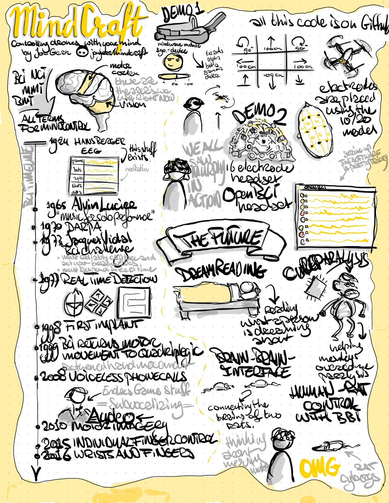

**[Getting Started](#getting-started)** | **[BCI Devices](#bci-devices)** | **[Drones](#drones)**

# Mindcraft

## Getting Started

Checkout the SXSW 2019 Slideshow and Movies

[Download Slides and Movies](https://drive.google.com/file/d/1XByvO6gcyoWVl9UORXk2Ro01nIck12OC/view?usp=sharing)

Courtesy of [Justus Sturkenboom](https://twitter.com/ju5tu5/status/1104514334993104897)

## BCI Devices

This presentation makes use of two BCI devices. The first a NeuroSky Mindwave Mobile 2 which is a single channel headset which is good for building BCI applications that can function off alpha and beta-rhythms. The second headset is a Ultracortex Mark IV by OpenBCI which can support up to 16 channels which allows for more complicated BCI experiments such as ones leveraging the visual cortex and the motor cortex.

### OpenBCI

Mindcraft leverages a 16 electrode OpenBCI EEG Headset setup with the daisy module. The following is a diagram using the 10-20 system to describe where to place electrodes on your headset.

Product List:

- Ultracortex Mark IV EEG Headset, 16 Channels
  - https://shop.openbci.com/collections/frontpage/products/ultracortex-mark-iv?variant=23280742211
- Cyton + Daisy Biosensing Boards
  - https://shop.openbci.com/collections/frontpage/products/cyton-daisy-biosensing-boards-16-channel?variant=38959256526

### NeuroSky

The Alpha/Beta wavelength demos leverage a NeuroSky MindWave Mobile 2 EEG Headset. NeuroSky does not sell their headset direct from their online store, you will need to purcahse it from Amazon.

- https://store.neurosky.com/pages/mindwave
- https://www.amazon.com/dp/B07CXN8NKX/ref=cm_sw_r_tw_dp_U_x_YV1CCb5NCHRKY

## Drones

This demo leverages a Parrot Mambo Minidrone but any Minidrone will work as long as it has Bluetooth Low Energy (BLE) Support.

- https://www.parrot.com/us/drones/parrot-mambo-fly
